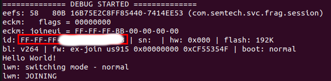
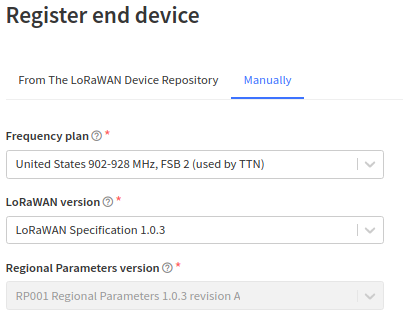
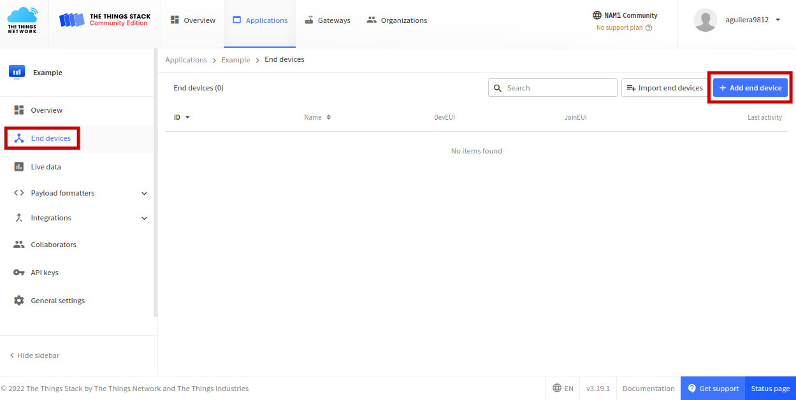
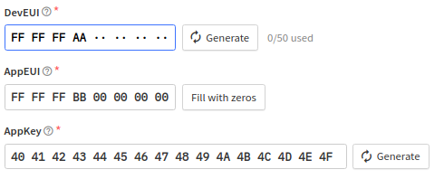

# Descripción
[Basicmac](https://basicmac.io/) es una implementación portátil de la especificación LoRaWAN® de [LoRa Alliance®](https://lora-alliance.org/) en el lenguaje de programación C. Es una bifurcación de la biblioteca LMiC de IBM y admite múltiples regiones, que se pueden seleccionar en tiempo de compilación y/o ejecución [[1]](https://basicmac.io/). Para la utilización de Basicmac se usará una terminal Linux, los comandos presentados a continuación funcionan para el sistema operativo Ubuntu 20.04, podrían variar si se trabaja desde otra distribución de Linux.

Esta guía tiene por finalidad conectar la tarjeta de desarrollo a un servidor de The Things Network, creando una aplicación y usando la frecuencia us 915 Khz.

# Requisitos previos
Las herramientas necesarias para construir y trabajar con Basicmac se muestran a continuación:
- Una cadena de herramientas de compilación cruzada adecuada `gcc-arm-none-eabi` y `libnewlib-arm-none-eabi`.

```bash
sudo apt-get update
sudo apt-get install gcc-arm-none-eabi
sudo apt-get install libnewlib-arm-none-eabi
```

- Un entorno con un intérprete de Python 3.8 o posterior.

```bash
sudo apt-get install python3.8-venv
```

- Una herramienta como OpenOCD para cargar el firmware en el hardware real.

```bash
sudo apt-get -y install openocd
```

- Una herramienta para compilar y administrar una colección de aplicaciones y archivos desde el código fuente.

```bash
sudo apt-get install make
```

- Una herramienta para clonar el repositorio de Basicmac en GitHub.

```bash
sudo apt-get install git
```

# Construcción y carga del proyecto

1. Clonar el repositorio de GitHub de Basicmac y todos sus submódulos.

```bash
git clone --recurse-submodules https://github.com/mkuyper/basicmac.git basicmac
```

2. Crear y activar un entorno virtual con Python dentro de la carpeta basicmac.

```bash
cd basicmac
python3 -m venv venv
source venv/bin/activate
```

3. Instalar los módulos de Python requeridos por las herramientas de compilación y simulación, se pueden instalar usando pip.

```bash
pip install -r basicloader/requirements.txt
pip install -r ./requirements.txt
pip install pyyaml
```

4. Basicmac emplea un gestor de arranque, Basicloader, para cargar e iniciar el firmware real. Este cargador de arranque también aplica cualquier actualización de firmware y verifica la integridad del firmware actual antes de llamar al punto de entrada del firmware. Para crear este cargador usar el siguiente comando:

```bash
cd basicloader
VARIANT=us915 make
```
El resultado del proceso de compilación es un archivo llamado *bootloader.hex*.

5. Conectar la tarjeta al computador mediante USB, verifique que el dispositivo es reconocido como una unidad USB con nombre *DIS\_L072Z*.

6. Después de compilar un proyecto, se puede cargar en un dispositivo. Tenga en cuenta que tanto el cargador de arranque como el firmware deben cargarse, aunque como el cargador de arranque rara vez cambia, generalmente solo se carga una vez. Para cargar el cargador de arranque y el firmware, respectivamente, use los objetivos `make loadbl` y `make load`.

```bash
cd ../projects/ex-join
VARIANT=us915 make loadbl
VARIANT=us915 make load
```

# Personalización

El HAL para STM32 almacena información de personalización como EUI y claves para el funcionamiento de LoRaWAN en EEPROM. Si no se encuentra información de personalización válida en la EEPROM, la HAL creará un dispositivo EUI a partir de los registros de ID únicos de la MCU's y utilizará una clave de prueba y un EUI de unión fijos [[1]](https://basicmac.io/guide/gettingstarted.html):

- Device EUI: `FF-FF-FF-AA-xx-xx-xx-xx`
- Join EUI: `FF-FF-FF-BB-00-00-00-00`
- Device Key: `404142434445464748494A4B4C4D4E4F`

Los valores de Join EUI y Device Key son los mismos para todas las tarjetas, solo el Device EUI es único para cada tarjeta. Para ver el Device EUI utilizado por la tarjeta de desarrollo, se deben seguir los siguientes pasos:

1. Abrir una nueva terminal o salir del directorio anterior.
2. En el B-L072Z-LRWAN1, el firmware imprime información de depuración en el UART que está conectado a través de ST-LINK a la computadora host. En Linux, este dispositivo suele aparecer como `/dev/ttyACM0`. Ejecutar el siguiente comando para lanzar el terminal serial minicom de la tarjeta:

```bash
sudo minicom -D /dev/ttyACM0 -b 2000000
```

3. Presionar los dos botones de reset de la tarjeta al tiempo. En la terminal se visualizara la salida de depuración. En esta se muestra el Device EUI como se muestra en la siguiente imagen.



# Conexión a The Things Network (TTN)

1. Entrar a la sección de aplicaciones de la pagina de The Things Network, a traves del link: https://nam1.cloud.thethings.network/console/applications

2. Crear un nueva aplicación presionando el botón de *add application* y dandole un nombre y un ID.

3. Ir a la pestaña de *End devices* y crear un nuevo dispositivo en *add end device*, como se muestra en la siguiente imagen.



4. Registrar manualmente el dispositivo como se muestra en la siguiente imagen.



5. Ingresar los datos de Device EUI, Join EUI y Device Key como se muestra en la siguiente imagen. Estos datos fueron dados en la sección anterior, recordar que el Device EUI es único de la tarjeta y se obtuvo en el paso 3 de la sección de Personalizaron. Por ultimo, presionar el botón de *Register end device*.



Una vez terminados estos pasos, ya se podrán visualizar los datos enviados por la tarjeta a TTN desde la pestaña *Live data* de la aplicación creada, siempre y cuando se tenga cobertura de un Gateway conectado a la red de TTN.


# Referencias

[[1] M. Kuyper. Basicmac, Getting Started, 2020](https://basicmac.io/guide/index.html)

[[2] ST. UM2115, User manual. Discovery kit for LoRaWAN™, Sigfox™, and LPWAN protocols with STM32L0](https://www.st.com/resource/en/user_manual/dm00329995-discovery-kit-for-lorawan-sigfox-and-lpwan-protocols-with-stm32l0-stmicroelectronics.pdf)

[[3] A crash course in LoRaWAN®, 2021](https://twaclaw.github.io/presentation_lora_lorawan/index.html)
